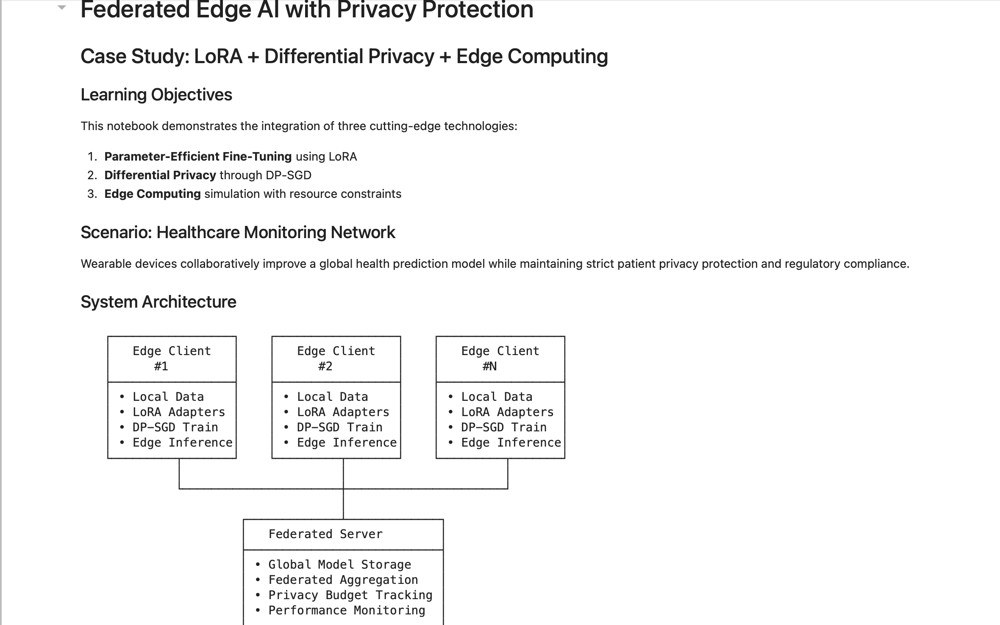
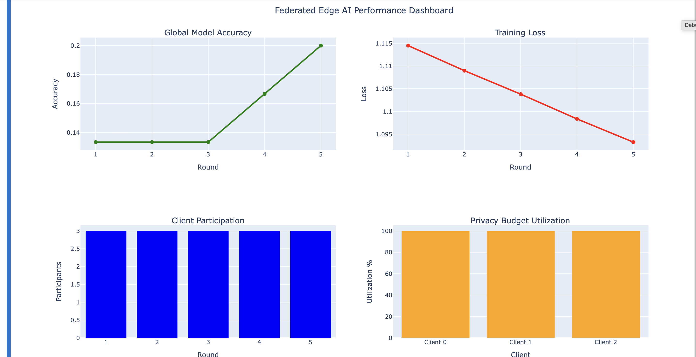

# Privacy-Preserving Federated Healthcare AI

## Federated Edge AI with Privacy Protection

**LoRA + Differential Privacy + Edge Computing for Healthcare Monitoring**

A privacy-preserving federated edge AI framework designed for healthcare monitoring using **Federated Learning**, **LoRA parameter-efficient fine-tuning**, **Differential Privacy (DP-SGD)**, and **Edge Computing simulation**.

This project demonstrates how distributed healthcare devices can collaboratively train machine learning models while maintaining patient privacy, reducing communication overhead, and supporting deployment in resource-constrained edge environments.

---

## Project Overview

Modern healthcare AI systems require scalable collaboration across distributed devices while preserving sensitive patient information.

This project simulates a **healthcare monitoring network** in which edge clients locally train models using private datasets and securely participate in federated aggregation without sharing raw patient data.

The system integrates three advanced AI technologies:

* **Federated Learning** — decentralized collaborative model training
* **LoRA (Low-Rank Adaptation)** — parameter-efficient fine-tuning
* **Differential Privacy (DP-SGD)** — formal privacy protection guarantees
* **Edge Computing** — resource-constrained local AI inference

---

## Key Features

* Privacy-preserving federated learning workflow
* LoRA parameter-efficient model fine-tuning
* Differential Privacy (DP-SGD) implementation
* Distributed healthcare edge simulation
* Federated aggregation server architecture
* Performance dashboard and visualization analytics
* System efficiency analysis
* Communication and memory reduction evaluation

---

## System Architecture



---

## Federated Training Results


---

## Performance Dashboard



---

## System Efficiency Analysis


---

## Technology Stack

* Python
* PyTorch
* Transformers (HuggingFace)
* PEFT / LoRA
* Opacus
* NumPy
* Pandas
* Matplotlib
* Plotly
* Scikit-learn

---

## Repository Structure

```text
Privacy-Preserving-Federated-Healthcare-AI/
│
├── notebooks/
│   └── Federated_Edge_AI_Privacy_Preserving_Healthcare_Case_Study.ipynb
│
├── visuals/
│   ├── architecture_diagram.png
│   ├── federated_training_results.png
│   ├── performance_dashboard.png
│   └── system_efficiency_analysis.png
│
├── README.md
├── requirements.txt
├── .gitignore
└── LICENSE
```

---

## Installation

```bash
pip install -r requirements.txt
```

---

## Running the Project

Launch Jupyter Notebook:

```bash
jupyter notebook
```

Open:

```text
notebooks/Federated_Edge_AI_Privacy_Preserving_Healthcare_Case_Study.ipynb
```

Run all notebook cells sequentially.

---

## Results & Insights

Key findings from the project include:

* Significant parameter reduction using LoRA fine-tuning
* Reduced communication overhead in federated aggregation
* Differential privacy guarantees for healthcare data protection
* Edge-device deployment feasibility under constrained resources
* End-to-end federated AI system performance monitoring

---

## Author

**Darious Brown**
PhD – Artificial Intelligence & Machine Learning Specialization

GitHub: https://github.com/Dare215
